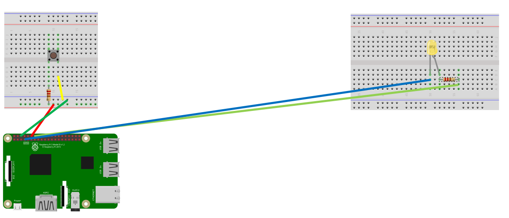
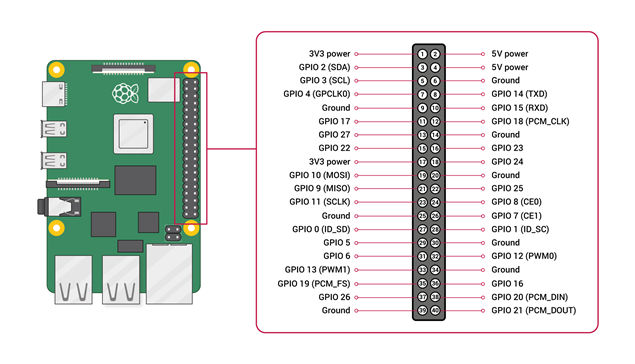
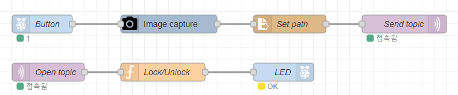

# iot_nodeRED_sequrity

# IOT SETTING(Raspberry Pi)

### Circuit Structure




### node-RED



```js
[
  {
    id: "1f16c12d1aef312e",
    type: "tab",
    label: "MECOM Security",
    disabled: false,
    info: "",
    env: [],
  },
  {
    id: "3f77cd13f8f8de8b",
    type: "mqtt out",
    z: "1f16c12d1aef312e",
    name: "Send topic",
    topic: "topic",
    qos: "2",
    retain: "",
    respTopic: "",
    contentType: "",
    userProps: "",
    correl: "",
    expiry: "",
    broker: "a0ace2e5f37dabd5",
    x: 710,
    y: 240,
    wires: [],
  },
  {
    id: "c310061cf4541ee6",
    type: "camerapi-takephoto",
    z: "1f16c12d1aef312e",
    filemode: "1",
    filename: "imageTest.JPEG",
    filedefpath: "0",
    filepath: "/home/shako/Desktop/",
    fileformat: "jpeg",
    resolution: "1",
    rotation: "0",
    fliph: "0",
    flipv: "0",
    brightness: "50",
    contrast: "0",
    sharpness: "0",
    quality: "80",
    imageeffect: "none",
    exposuremode: "auto",
    iso: "0",
    agcwait: "1.0",
    led: "0",
    awb: "auto",
    name: "Image capture",
    x: 320,
    y: 240,
    wires: [["1c3989cb789f0fd9"]],
  },
  {
    id: "cfef3a2f4dd656a3",
    type: "rpi-gpio out",
    z: "1f16c12d1aef312e",
    name: "LED",
    pin: "4",
    set: "",
    level: "0",
    freq: "",
    out: "out",
    bcm: true,
    x: 510,
    y: 320,
    wires: [],
  },
  {
    id: "6994069ba5d2311c",
    type: "function",
    z: "1f16c12d1aef312e",
    name: "Lock/Unlock",
    func: 'const userOutput = msg.payload;\nif(userOutput == "true"){\n    msg.payload = 1;\n}else{\n    msg.payload = 0;\n}\nreturn msg;',
    outputs: 1,
    noerr: 0,
    initialize: "",
    finalize: "",
    libs: [],
    x: 310,
    y: 320,
    wires: [["cfef3a2f4dd656a3"]],
  },
  {
    id: "1c3989cb789f0fd9",
    type: "file in",
    z: "1f16c12d1aef312e",
    name: "Set path",
    filename: "/home/shako/Desktop/imageTest.JPEG",
    filenameType: "str",
    format: "stream",
    chunk: false,
    sendError: false,
    encoding: "none",
    allProps: false,
    x: 520,
    y: 240,
    wires: [["3f77cd13f8f8de8b"]],
  },
  {
    id: "4e8b2aecbe296867",
    type: "rpi-gpio in",
    z: "1f16c12d1aef312e",
    name: "Button",
    pin: "18",
    intype: "up",
    debounce: "0",
    read: false,
    bcm: true,
    x: 110,
    y: 240,
    wires: [["c310061cf4541ee6"]],
  },
  {
    id: "5332408343ac8530",
    type: "mqtt in",
    z: "1f16c12d1aef312e",
    name: "Open topic",
    topic: "open",
    qos: "2",
    datatype: "utf8",
    broker: "193bfb70ac85c483",
    nl: false,
    rap: true,
    rh: 0,
    inputs: 0,
    x: 120,
    y: 320,
    wires: [["6994069ba5d2311c"]],
    outputLabels: ["open"],
  },
  {
    id: "a0ace2e5f37dabd5",
    type: "mqtt-broker",
    name: "",
    broker: "192.168.0.122",
    port: "1883",
    clientid: "",
    autoConnect: true,
    usetls: false,
    protocolVersion: "4",
    keepalive: "60",
    cleansession: true,
    birthTopic: "",
    birthQos: "0",
    birthPayload: "",
    birthMsg: {},
    closeTopic: "",
    closeQos: "0",
    closePayload: "",
    closeMsg: {},
    willTopic: "",
    willQos: "0",
    willPayload: "",
    willMsg: {},
    userProps: "",
    sessionExpiry: "",
  },
  {
    id: "193bfb70ac85c483",
    type: "mqtt-broker",
    name: "",
    broker: "192.168.0.122",
    port: "1883",
    clientid: "",
    autoConnect: true,
    usetls: false,
    protocolVersion: "4",
    keepalive: "60",
    cleansession: true,
    birthTopic: "",
    birthQos: "0",
    birthPayload: "",
    birthMsg: {},
    closeTopic: "",
    closeQos: "0",
    closePayload: "",
    closeMsg: {},
    willTopic: "",
    willQos: "0",
    willPayload: "",
    willMsg: {},
    userProps: "",
    sessionExpiry: "",
  },
];
```
